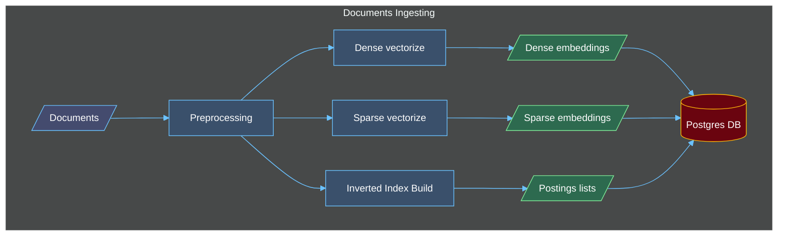

# CS419-RAG

## Architecture Diagrams

```mermaid
%%{init: {
  "theme": "dark",
  "themeVariables": {
    "primaryColor": "#2a2f4a",
    "primaryTextColor": "#ffffff",
    "secondaryColor": "#1f2233",
    "tertiaryColor": "#30344d",
    "lineColor": "#b089f0",
    "fontSize": "14px"
  }
}}%%
flowchart TD
    subgraph Users Retrieving
        A[/User Queries/]
        B[Dense vectorize]
        C[Sparse vectorize]
        P[Tokenize]
        D[/Query dense embeddings/]
        E[/Query sparse embeddings/]
        Q[/Tokenized Queries/]
        F[Querying DB]
        G[(Postgres DB)]
        H[Fusion]
        I[/Top-K Candidates/]
        J[Rerank with Cross-Encoder]
        K[/Reranked Candidates/]
        L[Prompt Augment]
        M[/Prompt with Context/]
        N[LLM Q&A]
        O[/Final Answers/]

        A --> B --> D --> F
        A --> C --> E --> F
        A --> P --> Q --> F
        F --> G --> H --> I --> J --> K --> L
        A --> L --> M --> N --> O

        class A input;
        class B,C,F,H,J,L,N,P process;
        class D,E,I,K,M,O,Q output;
        class G storage;
    end

    classDef input fill:#444b6e,stroke:#9d4edd,color:#fff;
    classDef process fill:#3a506b,stroke:#b089f0,color:#fff;
    classDef output fill:#2d6a4f,stroke:#80ed99,color:#fff;
    classDef storage fill:#6a040f,stroke:#ffba08,color:#fff;
```

## To-dos

- [x] Dense Embedding Retrieval (vector)
- [x] Sparse Embedding Retrieval (vector)
- [x] Hybrid Retrieval (vector)
- [x] Reranking with Cross-Encoder
- [x] Sparse Retrieval with Inverted Index (for presentation)
- [x] LLM Q&A
- [x] Dockerize the entire pipeline (still not test, not sure it can run)
- [ ] Support more scoring methods in inverted index retrieval (e.g., BM25 variants)
- [ ] Evaluate the retrieval with standard IR metrics (e.g., MAP, nDCG) and classic datasets (e.g., MS MARCO, TREC)
- [ ] Optimize the Ingestion request for raw file rather than file path
